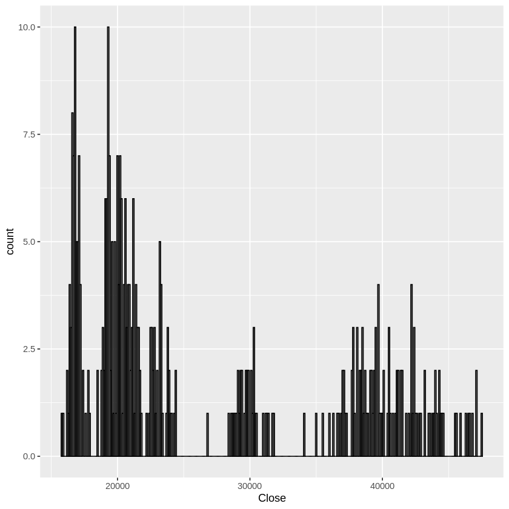
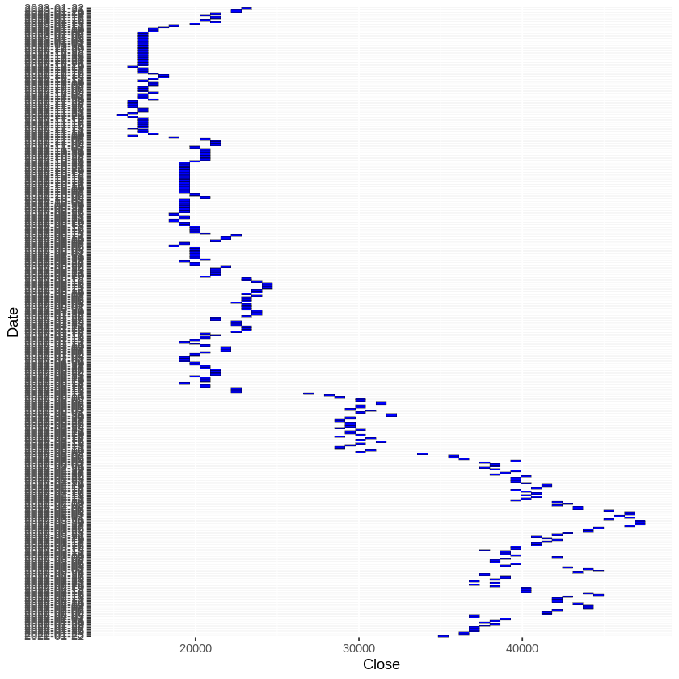
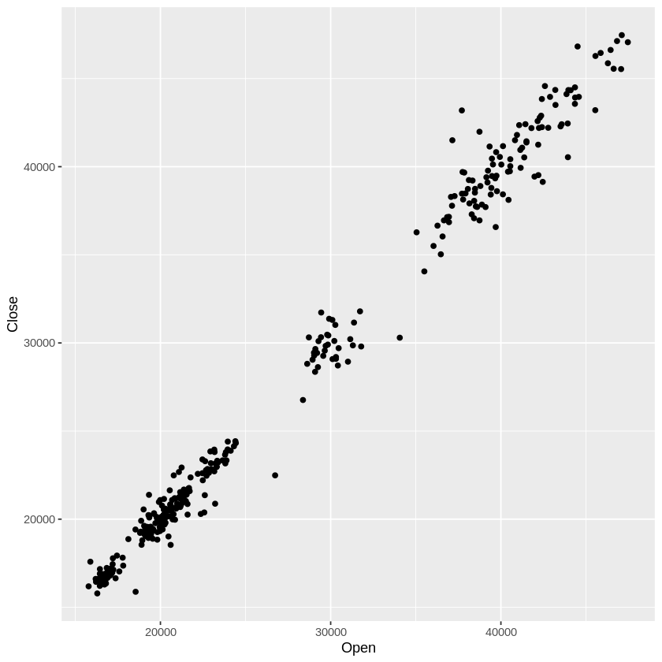
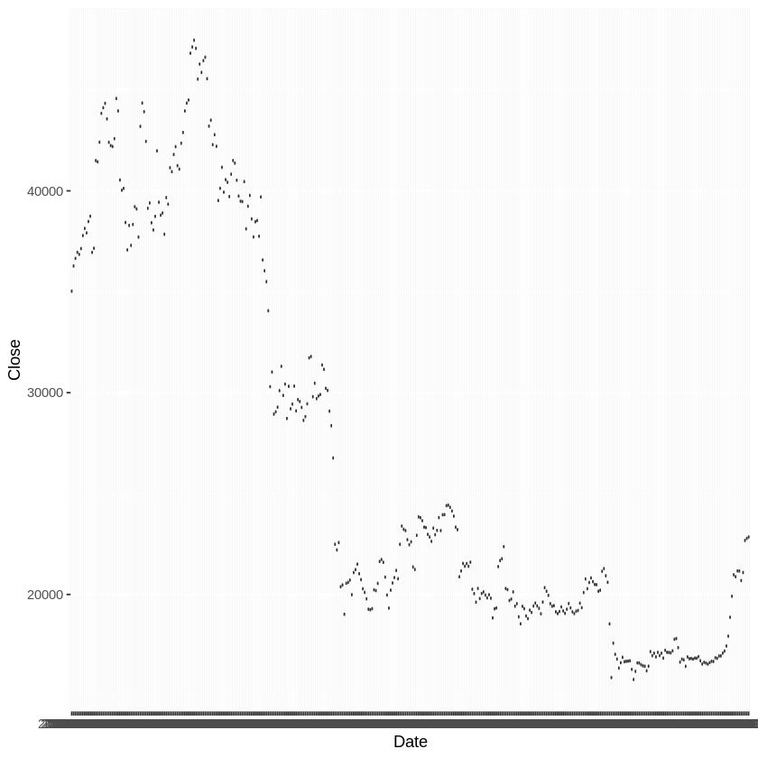
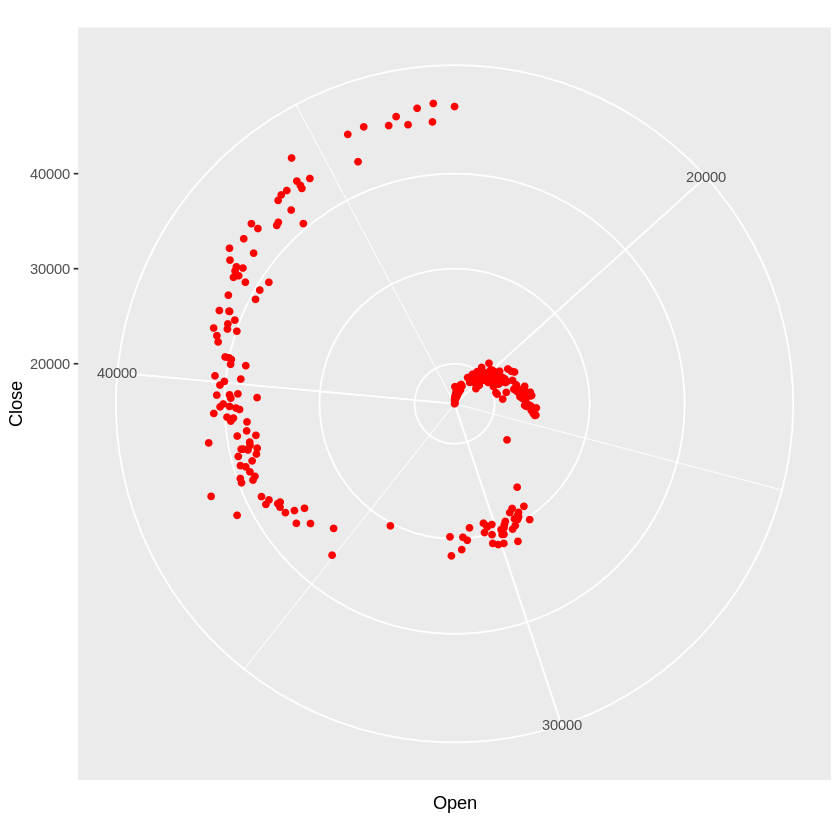
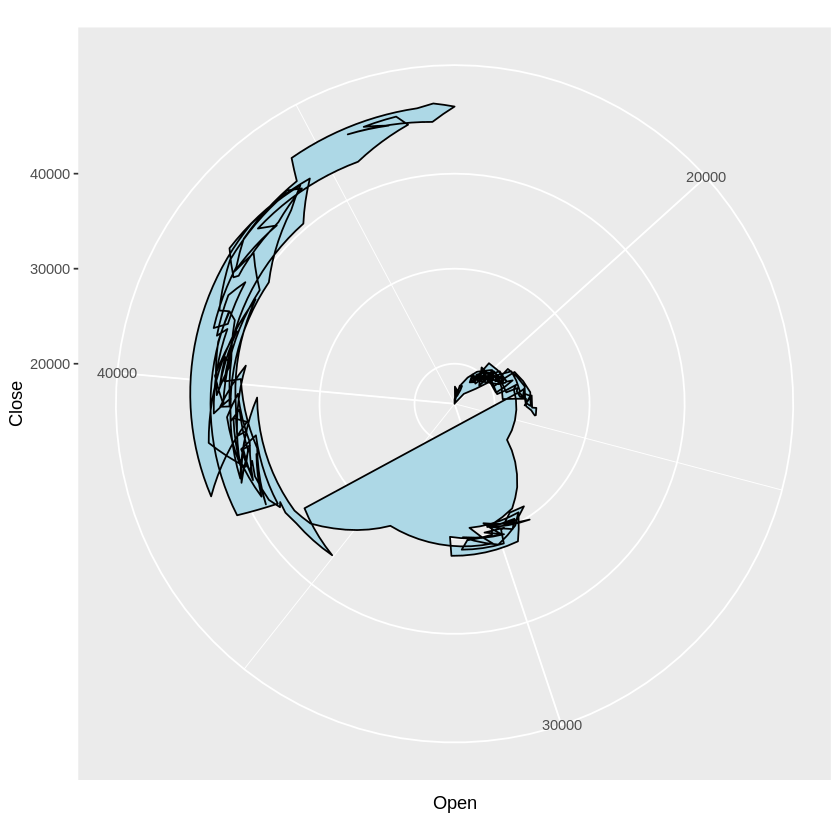
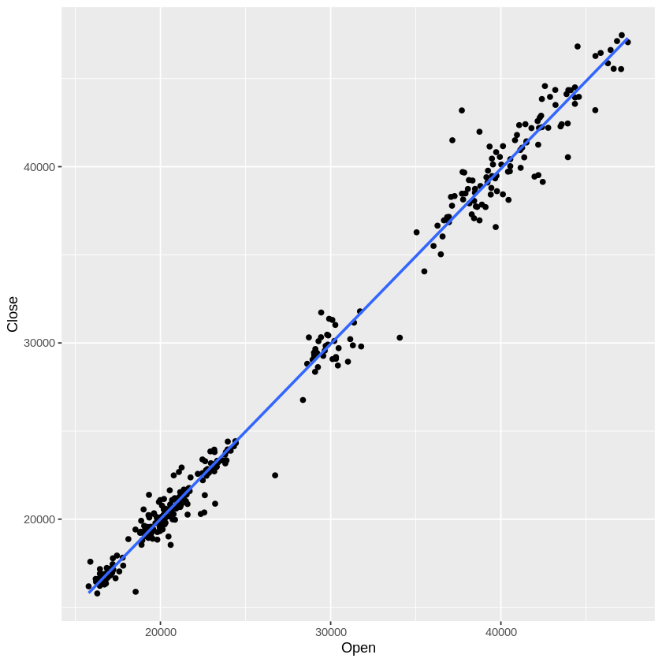
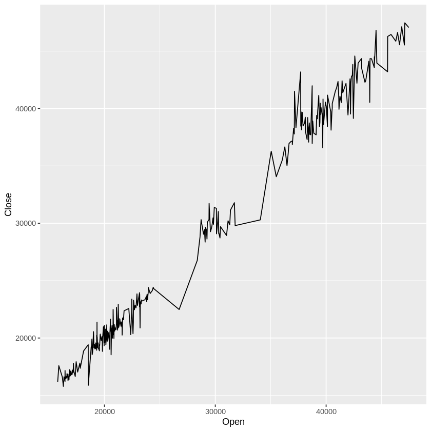
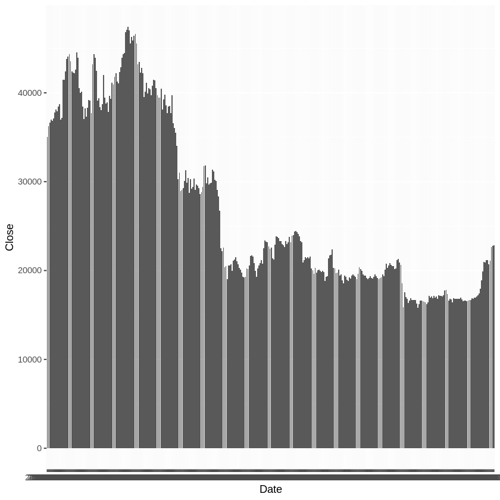
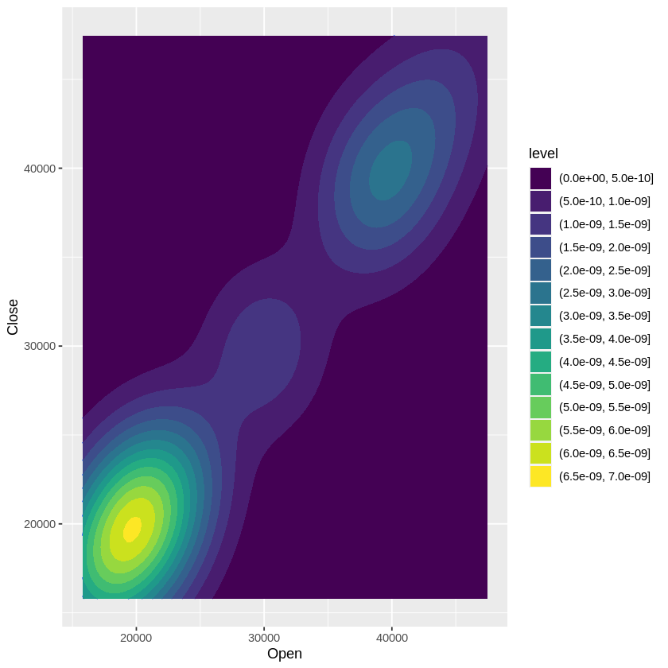

---
jupyter:
  colab:
  kernelspec:
    display_name: R
    name: ir
  language_info:
    name: R
  nbformat: 4
  nbformat_minor: 0
---

::: {.cell .markdown id="H31aq310Mmx5"}
### installing libs
:::

::: {.cell .code execution_count="15" colab="{\"base_uri\":\"https://localhost:8080/\"}" id="WO2SjjWyL9ne" outputId="b40a8076-8dfd-4597-d48d-2130cf359775"}
``` python
install.packages("plotly")
install.packages("magrittr")
install.packages("ggplot2")
library(ggplot2)
library(magrittr)
library(plotly)
```

::: {.output .stream .stderr}
    Installing package into ‘/usr/local/lib/R/site-library’
    (as ‘lib’ is unspecified)

    Installing package into ‘/usr/local/lib/R/site-library’
    (as ‘lib’ is unspecified)

    Installing package into ‘/usr/local/lib/R/site-library’
    (as ‘lib’ is unspecified)
:::
:::

::: {.cell .markdown id="mfJr4-L_L-3Z"}
### reading csv and exploring data
:::

::: {.cell .code execution_count="2" colab="{\"base_uri\":\"https://localhost:8080/\",\"height\":349}" id="mvI3SBe5KqHf" outputId="dd68b889-b726-4c68-99bb-06e9dd49b330"}
``` python
# Load the CSV file into a data frame
df <- read.csv("/content/sample_data/BTC-USD.csv")

# Display the first few rows of the data frame
head(df,8)
```

::: {.output .display_data}

A data.frame: 8 × 7

| <!--/--> | Date &lt;chr&gt; | Open &lt;dbl&gt; | High &lt;dbl&gt; | Low &lt;dbl&gt; | Close &lt;dbl&gt; | Adj.Close &lt;dbl&gt; | Volume &lt;dbl&gt; |
|---|---|---|---|---|---|---|---|
| 1 | 2022-01-22 | 36471.59 | 36688.81 | 34349.25 | 35030.25 | 35030.25 | 39714385405 |
| 2 | 2022-01-23 | 35047.36 | 36433.31 | 34784.97 | 36276.80 | 36276.80 | 26017975951 |
| 3 | 2022-01-24 | 36275.73 | 37247.52 | 33184.06 | 36654.33 | 36654.33 | 41856658597 |
| 4 | 2022-01-25 | 36654.80 | 37444.57 | 35779.43 | 36954.00 | 36954.00 | 26428189594 |
| 5 | 2022-01-26 | 36950.52 | 38825.41 | 36374.91 | 36852.12 | 36852.12 | 31324598034 |
| 6 | 2022-01-27 | 36841.88 | 37148.32 | 35629.28 | 37138.23 | 37138.23 | 25041426629 |
| 7 | 2022-01-28 | 37128.45 | 37952.88 | 36211.11 | 37784.33 | 37784.33 | 22238830523 |
| 8 | 2022-01-29 | 37780.71 | 38576.26 | 37406.47 | 38138.18 | 38138.18 | 17194183075 |
:::
:::

::: {.cell .markdown id="xsmmpeH_zapl"}
##### dataset summary
:::

::: {.cell .code execution_count="3" colab="{\"base_uri\":\"https://localhost:8080/\",\"height\":260}" id="ZXZVXtJhPlnT" outputId="45ff53eb-672f-46f6-91be-b8e03f68f768"}
``` python
summary(df)
```

::: {.output .display_data}
         Date                Open            High            Low       
     Length:366         Min.   :15782   Min.   :16253   Min.   :15599  
     Class :character   1st Qu.:19327   1st Qu.:19637   1st Qu.:19026  
     Mode  :character   Median :21617   Median :22377   Median :21084  
                        Mean   :26838   Mean   :27366   Mean   :26241  
                        3rd Qu.:37711   3rd Qu.:38643   3rd Qu.:36808  
                        Max.   :47457   Max.   :48087   Max.   :47100  
         Close         Adj.Close         Volume         
     Min.   :15787   Min.   :15787   Min.   :7.715e+09  
     1st Qu.:19325   1st Qu.:19325   1st Qu.:2.165e+10  
     Median :21619   Median :21619   Median :2.779e+10  
     Mean   :26801   Mean   :26801   Mean   :2.939e+10  
     3rd Qu.:37714   3rd Qu.:37714   3rd Qu.:3.392e+10  
     Max.   :47466   Max.   :47466   Max.   :1.190e+11  
:::
:::

::: {.cell .markdown id="GRK5xiTZzjeP"}
##### standard deviation
:::

::: {.cell .code execution_count="4" colab="{\"base_uri\":\"https://localhost:8080/\"}" id="NKHbfZ80Ps4S" outputId="5196d3d3-bbd4-4e0f-9b9b-8a2d88d882ac"}
``` python
print(paste('close std', sd(df$Close)))
print(paste('whole std', sd(c(df$Open, df$Close, df$High))))
```

::: {.output .stream .stdout}
    [1] "close std 9699.89446763083"
    [1] "whole std 9775.81911028684"
:::
:::

::: {.cell .markdown id="kDDM3wzQOQW2"}
### Plotting , visualization {#plotting--visualization}
:::

::: {.cell .markdown id="qURqaac3OON0"}
-   #### Simple and two-dimensional histogram

    ##### - Using the binwidth parameter, the width of the histogram intervals is specified {#--using-the-binwidth-parameter-the-width-of-the-histogram-intervals-is-specified}
:::

::: {.cell .code execution_count="5" colab="{\"base_uri\":\"https://localhost:8080/\",\"height\":437}" id="x6N5aXJhLiBS" outputId="c5b0f356-269a-4d2f-fe6f-eb52ddae0fb9"}
``` python
ggplot(df, aes(x=Close)) + 
  geom_histogram(binwidth=100, color="black", fill="white") 
# geom_histogram(aes(x=Open), binwidth=5, color="red", fill="white")
```

::: {.output .display_data}
{height="420"
width="420"}
:::
:::

::: {.cell .code execution_count="6" colab="{\"base_uri\":\"https://localhost:8080/\",\"height\":437}" id="VMNwnPmsPPbP" outputId="6038dfb8-4e0e-4dcf-b76d-f0f6cae0779e"}
``` python
ggplot() +
  geom_bin2d(data = df, aes(x = Close, y = Date), bins = 50, fill = "blue", color = "black")
```

::: {.output .display_data}
{height="420"
width="420"}
:::
:::

::: {.cell .markdown id="9wQRPjTeR2fQ"}
### Scatter Plot
:::

::: {.cell .code execution_count="7" colab="{\"base_uri\":\"https://localhost:8080/\",\"height\":437}" id="3Y2WiE1FPQZ1" outputId="a3ab3be6-687d-4cd0-b0e0-ebc71d22a571"}
``` python
ggplot(df, aes(x = Open, y = Close)) + 
  geom_point()
```

::: {.output .display_data}
{height="420"
width="420"}
:::
:::

::: {.cell .markdown id="91FeCiGoSOst"}
### box plot
:::

::: {.cell .code execution_count="8" colab="{\"base_uri\":\"https://localhost:8080/\",\"height\":437}" id="5L3Ggmlc7Ybs" outputId="dc220ec7-3ea5-47e8-cd5e-fb7914e3abf9"}
``` python
ggplot(data = df, aes(x = Date, y = Close)) + 
  geom_boxplot()
```

::: {.output .display_data}
{height="420"
width="420"}
:::
:::

::: {.cell .markdown id="sXfumMFlUJRO"}
### Pie Chart

##### - This chart can be used to show the percentage distribution of different values of a variable in a circle. {#--this-chart-can-be-used-to-show-the-percentage-distribution-of-different-values-of-a-variable-in-a-circle}
:::

::: {.cell .code execution_count="9" colab="{\"base_uri\":\"https://localhost:8080/\",\"height\":437}" id="Y4cl322Z8jzD" outputId="3c703fb9-4a3a-459c-ca2b-b1bd3bb477e8"}
``` python
ggplot(df, aes(x = Open)) +
  geom_point(aes(y = Close), color = "red") +
  coord_polar()
```

::: {.output .display_data}
{height="420"
width="420"}
:::
:::

::: {.cell .markdown id="FjTPBmk9Yt3J"}
### Radar Chart
:::

::: {.cell .code execution_count="10" colab="{\"base_uri\":\"https://localhost:8080/\",\"height\":437}" id="ypu0Cgy2YuFq" outputId="a746933b-6f75-41c9-aa47-cdb83446060d"}
``` python
ggplot(df, aes(x = Open, y = Close)) +
  geom_polygon(fill = "lightblue", color = "black") +
  coord_polar()
```

::: {.output .display_data}
{height="420"
width="420"}
:::
:::

::: {.cell .markdown id="B-IFs2nFZyTu"}
### finding best line
:::

::: {.cell .code execution_count="27" colab="{\"base_uri\":\"https://localhost:8080/\",\"height\":454}" id="Z-Jf-tbmZyms" outputId="7dfaf9ed-6290-4821-b24d-5a8332e056b9"}
``` python
ggplot(data = df, aes(x = Open, y = Close)) + 
  geom_point() + 
  geom_smooth(method = "lm", se = FALSE)
```

::: {.output .stream .stderr}
    `geom_smooth()` using formula = 'y ~ x'
:::

::: {.output .display_data}
{height="420"
width="420"}
:::
:::

::: {.cell .code execution_count="18" id="VhzkVBwoaG1f"}
``` python
#for non linear

# ggplot(data = df, aes(x = Open, y = Close)) + 
#   geom_point() + 
#   stat_smooth(method = "lm", formula = y ~ poly(x, 2), se = FALSE, color = "red")
```
:::

::: {.cell .markdown id="JBwmMvu3bius"}
### Trajectory Plot
:::

::: {.cell .code execution_count="13" colab="{\"base_uri\":\"https://localhost:8080/\",\"height\":437}" id="a8d_8T5cbjXZ" outputId="77fb8d47-63aa-459a-bb5b-94fa2f0ba2cd"}
``` python
ggplot(df, aes(x = Open, y = Close)) +
  geom_line()
```

::: {.output .display_data}
{height="420"
width="420"}
:::
:::

::: {.cell .markdown id="uMrrT8FnhQX1"}
### Bar Plot
:::

::: {.cell .code execution_count="25" colab="{\"base_uri\":\"https://localhost:8080/\",\"height\":437}" id="6PM0jVVhhRDk" outputId="932a6545-8e24-48bc-e215-bb5c71e92292"}
``` python
ggplot(df, aes(x = Date, y = Close)) + 
  geom_col()
```

::: {.output .display_data}
{height="420"
width="420"}
:::
:::

::: {.cell .markdown id="komNPHFxhtKg"}
### 2D Density Plot {#2d-density-plot}
:::

::: {.cell .code execution_count="28" colab="{\"base_uri\":\"https://localhost:8080/\",\"height\":437}" id="Pu9mSPE7htll" outputId="92ef7d69-6f6c-402d-bd1e-de655bd6debf"}
``` python
ggplot(df, aes(x = Open, y = Close)) + 
  geom_density_2d() +
  geom_density_2d_filled() 
```

::: {.output .display_data}
{height="420"
width="420"}
:::
:::
